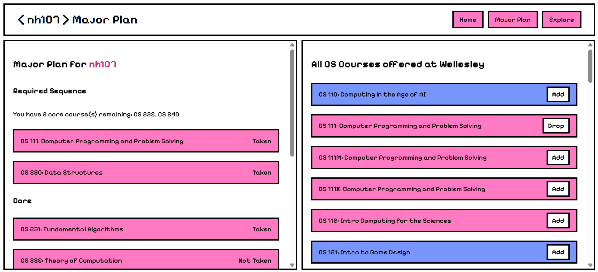
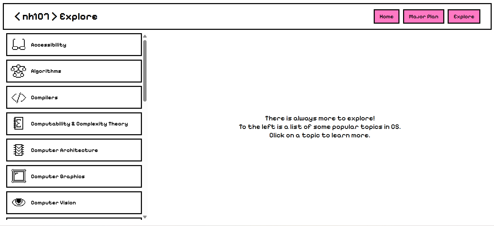

# Wellesley CS Hub

CS Hub is a website where Wellesley CS majors and other students interested in CS can view course offerings, plan their major and explore the many fields of CS. It was made for the UpSkill: Software Development Lifecycle program.

## Authors
* Nina Howley '27
* Aileen Liang '28

## Contents
```
* templates/
* app.py
* README.md
```

## Quick Start
```
pip install flask
flask --app app run
```

## Milestones

Milestone 1:

1. Scrape courses (separate core vs elective courses)
2. Create the three pages with navigation bar and basic routing between


Milestone 2:

1. Implement major tracking page with checklist
2. Implement explore page with clickable topics


Milestone 3:

1. Add popups to explore page and course offerings
2. Add information to explore page

## Technology used

Frontend: Flask, HTMl, CSS, JavaScript

Backend: Python and SQLite

## Next steps

Add more topics and opportunities to the explore page

Allow classes to be added or dropped from the home page spring offerings

Allow users to indicate if they skipped courses or took cross-register equivalents

Implement more robust login with passwords

## Screenshots

<h2>Home


<h2>Major Plan


<h2>Major Plan - Course Popup


<h2>Explore


<h2>Explore - Topic Popup
