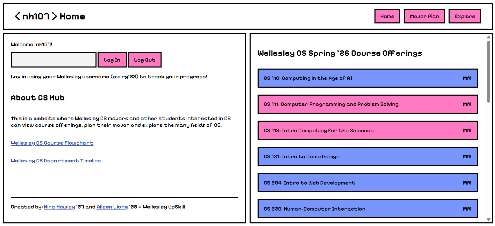
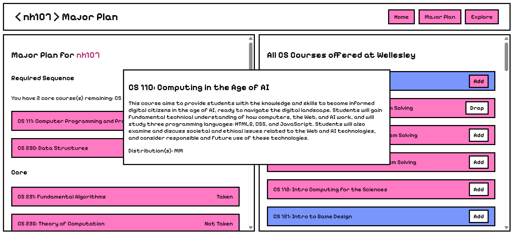

# Wellesley CS Hub

Wellesley CS Hub is a website where Wellesley CS majors and other students interested in CS can view course offerings, plan their major, and explore the many fields of CS. 

Nina and Aileen made this for the UpSkill: Software Development Lifecycle program.

## How to Use

### Home Page

Enter your Wellesley ID (or any username) to **log in**. Explore courses offered in the **current semester** on the right.



### Major Plan

Explore Wellesley's full list of CS courses on the right. Hover over each course to read its **course description**. You can click "Add" to **add a course** to your profile, and "Drop" to remove it.

Your **major panel** on the left will update with your progress as you take more CS classes. :)



### Explore Page

The scrollable **topic list** on the left displays some popular topics in CS (and unique topics that our professors research)! Click on each topic to view a **popup** with more information.


## Quick Start

1. **Clone the repository**
    ```
    git clone https://github.com/ninahowley/cs-hub.git
    ```
2. **Optional: create a [virtual environment](https://gist.github.com/ryumada/c22133988fd1c22a66e4ed1b23eca233).**
3. **Install flask**
    ```
    pip install flask
    ```
4. **Run the app!**

   Mac: ```flask --app app run```

   Windows: ```python app.py```

## Contents

+ ```templates/``` contains html files for all webpages.
    + ```templates/index.html``` contains the main webpage with login and spring '26 courses.
    + ```templates/major-plan.html``` contains a personalized major planning page, including requirements and all Wellesley CS courses.
    + ```templates/explore.html``` contains explore page with topic list and information popups.
+ ```app.py``` is the main app, handling routing with Flask.
+ ```static/``` contains the styling template and formatted .json files for CS course data.
+ ```courses/``` contains scraped CS course data from the Wellesley College courselist.
+ ```db_functions.py``` contains database functions (using SQLite).

## Technology Stack
+ **Frontend:** Flask, HTMl, CSS, JavaScript
+ **Backend:** Python and SQLite

## Authors

Nina Howley '27, Aileen Liang '28

## Design Process and Next Steps

**Milestone 1:**
+ Scrape courses (separate core vs elective courses)
+ Create the three pages with navigation bar and basic routing

**Milestone 2:**
+ Implement major tracking page with checklist
+ Implement explore page with clickable topics

**Milestone 3:**
+ Add popups to explore page and course offerings
+ Add information to explore page

**Next Steps:**
+ Add more topics and opportunities to the explore page
+ Allow classes to be added or dropped from the home page spring offerings
+ Allow users to indicate if they skipped courses or took cross-register equivalents
+ Implement more robust login with passwords

## License

Wellesley